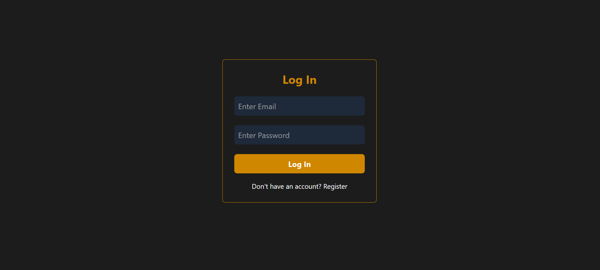
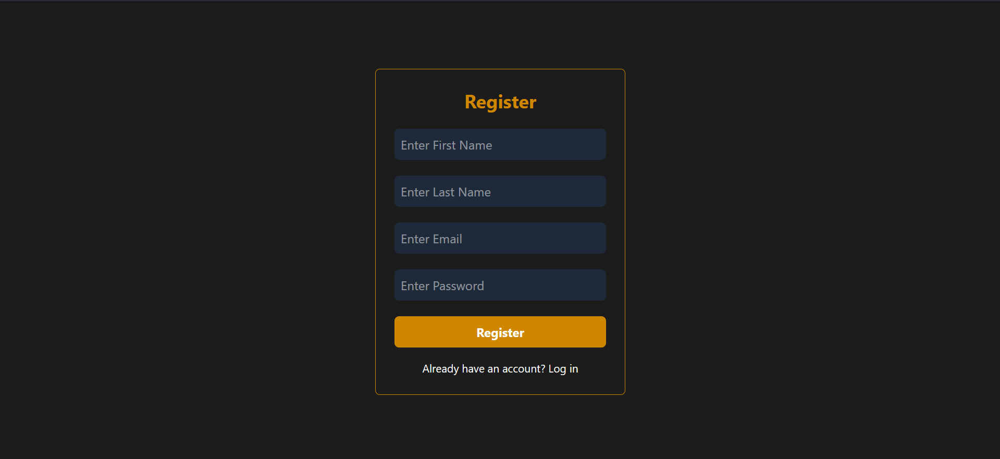
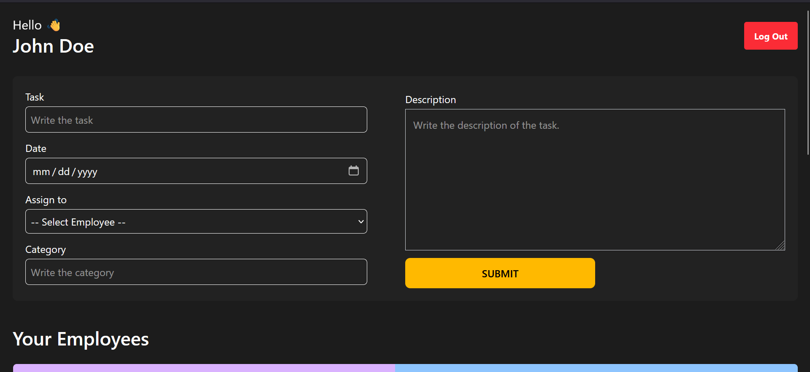
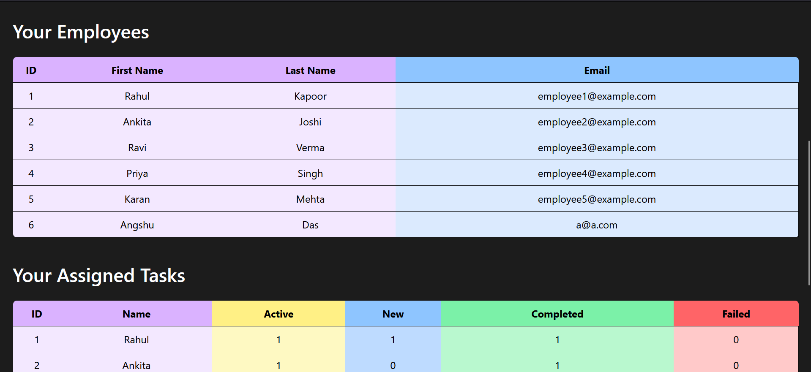
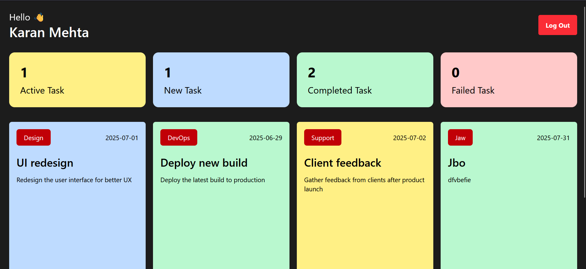

# Employee Management System

A **Frontend-only Employee Management System** built using **React.js** and **Tailwind CSS**, leveraging **LocalStorage** for data persistence. The app features role-based dashboards for admin and employees, allowing seamless task assignment, status tracking, and management.


## 🚀 Features

- **Authentication System**
  - One predefined admin
  - Employee registration and login supported
- **Admin Dashboard**
  - View all registered employees
  - Assign tasks to any employee
  - Monitor task statistics: Active, New, Completed, Failed
- **Employee Dashboard**
  - View personal tasks categorized by status
  - Accept new tasks, mark tasks as complete or failed
- **Local Storage Data Persistence**
  - Stores user sessions, employee records, and task data in localStorage
- **Modern UI**
  - Built with **Tailwind CSS** for responsive and elegant styling


## 👤 Admin and Demo Employee Accounts

### 🔐 Admin Login (Only One Admin)

> The admin is predefined and has full access to all employee-related data and task assignment functionalities.


| Name         | Email                    | Password |
|--------------|--------------------------|----------|
| John Doe | admin@example.com   | 123      |

---

### 👥 Demo Employee Accounts

> These demo users are already registered with sample task data.

| Name         | Email                    | Password |
|--------------|--------------------------|----------|
| Rahul Kapoor | employee1@example.com    | 123      |
| Ankita Joshi | employee2@example.com    | 123      |
| Ravi Verma   | employee3@example.com    | 123      |
| Priya Singh  | employee4@example.com    | 123      |
| Karan Mehta  | employee5@example.com    | 123      |

---

### 📝 Register as a New Employee

You can also register a new employee from the login page.  
> ⚠️ Only employees can register. **Admin cannot be created via the UI.**


## 💡 What I Learned

1. **React.js**: State, props, context API, and component-based architecture
2. **Tailwind CSS**: Building responsive, utility-first styled UIs
3. **LocalStorage API**: Data persistence without a backend
4. **Role-based UI Logic**: Handling conditional rendering for admin vs. employees
5. **Task Management Logic**: Designing features like task assignment, status checking, mark as completed and failed, accepting new tasks etc.


## 🛠️ Technologies Used

- **React.js**
- **Tailwind CSS**
- **JavaScript (ES6+)**
- **LocalStorage API**
- **Vite** (for development & build)


## 📂 Project Structure

```bash
EMPLOYEE_MANAGEMENT_SYSTEM/
├── node_modules/             
├── public/                   
├── src/
│   ├── assets/               
│   ├── components/
│   │   ├── auth/
│   │   │   └── Login.jsx
│   │   ├── dashboard/
│   │   │   ├── AdminDashboard.jsx
│   │   │   └── EmployeeDashboard.jsx
│   │   ├── others/
│   │   │   ├── Activity.jsx
│   │   │   ├── ActivityList.jsx
│   │   │   ├── AllAssignedTasks.jsx
│   │   │   ├── AllEmployeeDetails.jsx
│   │   │   ├── CreateTask.jsx
│   │   │   ├── Footer.jsx
│   │   │   ├── Header.jsx
│   │   │   ├── Task.jsx
│   │   │   └── TaskList.jsx
│   ├── context/
│   │   └── AuthProvider.jsx
│   ├── modal/
│   │   └── Modal.jsx
│   ├── utils/
│   │   └── LocalStorage.jsx
│   ├── App.jsx
│   ├── main.jsx
│   └── index.css
├── .gitignore
├── eslint.config.js
├── index.html
├── package.json
├── package-lock.json
├── postcss.config.js
├── tailwind.config.js
├── vite.config.js
└── README.md
```

## ⚙️ Installation and Setup

1. **Clone the Repository**
   ```bash
   git clone https://github.com/Angshu09/Employee_Management_System.git
   ```

2. **Navigate to the Project Directory**
   ```bash
   cd Employee_Management_System
   ```

3. **Install Dependencies**
   ```bash
   npm install
   ```

4. **Start the Development Server**
   ```bash
   npm run dev
   ```

5. Open your browser and navigate to `http://localhost:5173/` to explore this project.

## 📸 Screenshots

### Login & Register



### Admin Dashboard



### Employee Dashboard


---

Developed with ❤️ by **Angshu Das**.